#GCSE Controlled Assessment 1 - Encryption program


 - Candidate Name: Edward Digby,  
 - Candidate Number: 6035  
 - Centre Name: Bourne Grammar School,  
 - Centre Number: 26202  


##Design Part 1

**Users Needs from the encryption program**

When a user uses my encryption program, they will be able to encrypt the file that they have uploaded with an eight character key which the user will know and store. Then they will be able to save the file to any destination they select.

The user should be able to open up the program and have 4 options:

1. To Encrypt
2. To Securely Encrypt
3. To Decrypt
4. To Exit

#####Option 1 (To Encrypt A File)
When Option 1 is selected (by typing A) the user will be asked for the path of the file they want to encrypt. Then the program will check whether the file path is valid, and if the file is a .txt file. Then the user will be asked: "Is this the file you want to encrypt? [Yes/No]". If the user inputs "No" they will be sent back to the start of the encryption program. If the user types in "Yes" they program will present them an eight character key which is the encryption key for that specific file. There will be a warning saying "Please remember this key as you cannot decrypt the file without it. OK? [Yes]". Then when the user types "Yes", they will be asked for a file destination for their new encrypted file. If the file destination doesn't exist there will be a message saying: "Sorry that destination doesn't exist. Would you like to create it? [Yes/No]". If the user enters "Yes", the new file will be created in the new destination. If they select no they will be asked to re-enter the save destination. If the file destination does exist it will ask you to confirm the destination, and will present the user with the message: "You’re File Has Been Encrypted Successfully!".

#####Option 2 (To Securely Encrypt A File)
When Option 2 is selected (by typing B) the user will be asked for the path of the file they want to encrypt. Then the program will check whether the file path is valid and it is a .txt file. Then the user will be asked: "Is this the file you want to encrypt? [Yes/No]". If the user inputs No they will be sent back to the start of the encryption program. If the user types in "Yes" they program will present them an eight character key which is the encryption key for that file. There will be a waning saying "Please remember this key as you cannot decrypt the file without it. OK? [Yes]". Then when the user types "Yes", they will be asked for a file destination for their new encrypted file. If the file destination doesn't exist there will be a message saying: "Sorry that destination doesn't exist. Would you like to create it? [Yes/No]". If the user enters "Yes" the new file will be put in the new destination. However, if they enter "No", they will be asked to re-enter the destination to save to. If the file destination does exist it will ask you to confirm the destination. Then it will present you with a message: "You’re File Has Been Encrypted Successfully!".

#####Option 3 (To Decrypt A File)
When Option 3 is selected (by entering C) the user will be asked of the file path of the file that they want to decrypt. If the file path is invalid they will get an error saying: "Sorry that file doesn't exist. Please try again". If the file does exist they will be asked for their 8 character encryption key, given to them when the encrypted the file. If the key is too short or too long they will get an error message saying: "Sorry that key is [too long/ too short] please try again". If the key is correct they will then be asked for the level of security they entered when the file was encrypted [standard or secure]. Next they will input the destination where they want to save the decrypted file to. If they enter an incorrect path, there will be a message saying: "That destination doesn't exist. Do you want it created? [Yes/No]". If the user enters "Yes" the file will be created in the now existing folder. If they select no they will be asked to enter a new destination. Then they will be asked to confirm the destination and if they enter yes they will be presented with a message saying: "Your file has been decrypted successfully!"  


#####Option 4 (To Exit The Program)
When option 4 is selected (by entering D) a pop-up will show with the text 'Are you sure you want to exit?' and two buttons saying Yes and No. If "Yes" is entered the window will close. If "No" is selected the program will take the user back to the main menu.


#####Errors
If the user enters any other key apart from A,B,C,D they will be presented with an error: "I'm sorry that isn't an option, please try again:".

####Flowchart
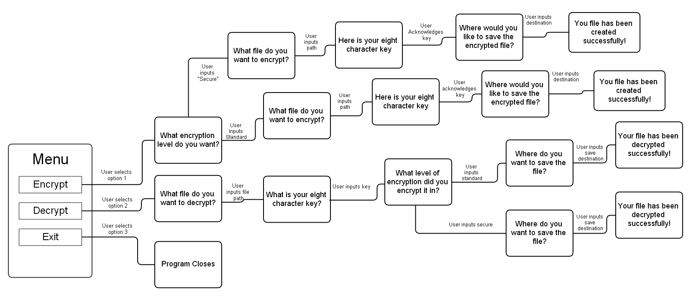

###Full Psuedocode:
```
FUNCTION mainmenu()
	Choice <-- "NULL"
	choices <-- ["A", "B", "C", "EXIT"]
	##While no choice has been selected
	WHILE UCase(Choice) !=  choices[1..4]
				OUTPUT "Main Menu"
				OUTPUT "A - Encrypt"
				OUTPUT "B - Decrypt"
				OUTPUT "C - Exit"

				##Ask the user to choose an option
				OUTPUT "Please type A,B or C"
				Choice <-- USERINPUT
				Choice <-- UCase(Choice)

				IF Choice = choices[1] THEN
					##Run the encryption function
					Encrypt()
				ELSE IF Choice = choices[2] THEN
				     ##Run the extended encryption function
				    SecureEncrypt()
				ELSE IF Choice = choices[3]  THEN	
					##Run the decrypt function
					Decrypt()
				ELSE IF Choice = choices[4] THEN
					##Ask the user to confirm exiting the program
		       		OUTPUT "Are You Sure? [Yes/No]"
					sure <-- USERINPUT
					sure <-- UCase(sure)

		       		##If sure is yes exit
		       		IF sure = "YES" THEN
		       		    OUTPUT "Goodbye"
		       		    EXIT
		       		ELSE
		       		    choice <-- "NULL"
					ENDIF		
	ENDWHILE
ENDFUNCTION

FUNCTION readfile(FileName)
	##Define fileloaded as a boolean and set to false
    fileloaded <-- False
	##Define sure as a string and set to null
    sure <-- "NULL"
	##Set while loop
    WHILE fileloaded = False
		TRY
		    ##Open File with the name the user entered
			f <-- OPEN(FileName)
			##Set text to the file contents
			text <-- READ(file)
			##Close the file
			CLOSE(f)
			##Check to see if the file ends with .txt
			IF FileName ENDSWITH ".txt" THEN
					fileloaded <-- True
					WHILE sure ≠ "YES" OR sure ≠ "NO"
						##Ask the user to confirm the file to open
                    	OUTPUT "Is this the file: " + FileName + "you want to open [Yes /No]"
						sure <-- USERINPUT
						sure <-- UPPERCASE
						IF sure = "YES" OR sure = "Y" THEN
							OUTPUT "File Loaded!"
							##Return the text
							RETURN text
						ELSE IF sure = "NO" or sure = "N" THEN
							fileloaded <-- False
							##Ask the user for the file name
                        	OUTPUT "What file would you like to open?"
							FileName <-- USERINPUT
						ELSE
							OUTPUT "Please enter Yes or No"
						ENDIF
			ELSE
				OUPTPUT "Sorry that file isn't a .txt file. Please try again"
				fileloaded <-- False
				OUTPUT "What file would you like to open?"
				FileName <-- USERINPUT
			ENDIF
		##If there is an error do this
        EXCEPT
			OUTPUT "File Not Found"
			fileloaded <-- False
			OUTPUT  "What file would you like to open?"
			FileName <-- USERINPUT
	ENDWHILE
ENDFUNCTION

##Define Generate Key Function
FUNCTION GenerateKey()
		key <-- ""
		FOR  i  <-- 1 TO 8
			##Set x to a random number between 33 and 127
        	x <-- GET A RANDOM NUMBER BETWEEN 33 AND 127
			x <-- CHR CONVERT TO ASCII VALUE
		    ##Add it on to the end of the final key string
        	key <--key + x
		ENDFOR
		RETURN key
ENDFUNCTION

##Determine Offset factor
FUNCTION calcoffset(key)
	offset <-- 0
	FOR i <-- 1 TO 8
		##Set x to the ascii value of the character selected
        x <-- key[i]
		x <-- CONVERT TO NUMBER FROM ASCII VALUE
		##Add x to the end  of the offset integer
        offset <-- offset + x
	ENDFOR
	##Devide the total by 8, round it down and minus 32
    offset <-- ROUND offset / 8
	offset <-- offset- 32
	##Return the offset value
    REUTRN offset
ENDFUNCTION

##Define Encrypt Text Function
FUNCTION EncryptText(text, offset)
	finaltext <-- ""
	##Strip text
	text <-- STRIP(text)
	FOR c IN text
		##Set x to the ascii value of c and add the offset
		x <-- c
		x <-- CONVERT CHARACTER TO ASCII VALUE
		x <-- x + offset
		##Check to see if it is greater than 126
        IF x > 126 THEN
			x <-- x - 94
		END IF
		##Convert the ascii value back to a letter
        x <-- CONVERT VALUE TO CHARACTER
		text <-- text MINUS THE LETTER
		##Add it to the end of the finaltext string
        finaltext <-- finaltext + x
	ENDFOR
	##Return the value of final text
	RETURN finaltext
ENDFUNCTION

##Function to write a file
FUNCTION writefile(FileName, text)
	##Define the boolean filesaved, set it to False
    filesaved <-- False
	WHILE filesaved = False
		##Ask the user for the filename
        OUTPUT "What would you like to save the encrypted file as?"
		FileName <-- USERINPUT
		##If stripped is the value nothing or just the extension
        IF STRIPPED FileName = "" OR STRIPPED FileName = ".txt" THEN
			filesaved <-- False
			OUTPUT "Please enter a valid file name"
		ELSE
			##Check to see if the filename ends with .txt
            IF FileName ENDSWITH ".txt" THEN
				PASS
			ELSE
				##If not add it to the end of the filename.
                FileName <-- FileName + ".txt"
			ENDIF
			TRY
				##Create a file with the name the user entered and set to FileName
                f <-- OPEN(FileName)
				##Write the encrypted text to it
                f.WRITE(text)
				##Close the file
				CLOSE(f)
				OUTPUT "File Written at: " + FileName
				filesaved <-- True
				RETURN
			##If there is an error do this
            EXCEPT
				OUTPUT "Sorry there was an error saving your file. Please try again"
				filesave <-- False
		ENDIF
	ENDWHILE
ENDFUNCTION

FUNCION Decrypt(text, offset)
	finaltext <-- ""
	FOR c in text
		x <-- c
		IF x = " " THEN
			finaltext <-- finaltext + " "
		ELSE
			##Set x to the Converted the string into the ascii value.
            x <-- ASCII VALUE OF x
			##Minus the offset
            x <-- x - offset
			##Check to see if the value is less than 33
            IF x < 33 THEN
				x <-- x + 94
			ENDIF
			##Convert the ascii value back to a string
            x <-- Character OF ASCII VALUE
			##Add the value of x onto the end of the string finaltext.
            finaltext <-- finaltext + x
		ENDIF
	ENDFOR
RETURN finaltext
ENDFUNCTION

## Define Secure Encrypt Text Function
FUNCTION SecureEncryptText(text, offset)
	##Define the empty string final text
    finaltext <-- ""
	##Strip the string variable text
    ##Remove all spaces
    text <-- STRIPPED text
	text <-- REMOVE SPACES
	##Define a new integer variable called chct
    chct <-- 0
	FOR c in text
		chct <-- chect + 1
		##Set x to the ascii value of the character (in c) and add on the offset
        x <-- ASCII VALUE OF X + offset
		##Check to see if the value is greater than 126
        IF x > 126 THEN
			x <-- - 94z
		ENDIF
		##Convert back to a string from the ascii value
        x <-- CHARACTER OF ASCII VALUE
		##Add onto the end  of the finaltext string
        finaltext <-- + x
		##Check if the variable chct, when divided by five is 0.
        IF chct MOD 5 = 0 THEN
		    ##Add a space onto the text
		 	space <-- ASCII VALUE OF " "
			space <-- space + offset
			finaltext <-- + CHARACTER OF SPACE
	ENDFOR
ENDFUNCTION


FUNCTION encrypt()
	##Ask the use for the filename
    OUTPUT "What file would you like to open?"
	##Read the file and set the contents to filetext
    filename <-- USERINPUT
	filetext <-- readfile(filename)
	##Generate the key to encrypt the text
    key <-- GenerateKey()
	OUTPUT "Your key is:" + key
	OUTPUT "Do not forget this key"
	##Generate the offset value from the key
    offsetfactor <-- CalcOffset(key)
	##Encrypt the text and set the returned text to EText
    EText <-- EncryptText(filetext, offsetfactor)
	##Write the encrypted text to a file
    writefile(EText)
ENDFUNCTION

FUNCTION secureencrypt()
	##Ask the user for the filename to read from
    OUTPUT "What file would you like to open?"
	filename <-- USERINPUT
	filetext < -- readfile(filename)
	key <-- GenerateKey()
	OUTPUT "Your key is: " + key
	OUTPUT "Do not forget this key"
	offsetfactor <-- CalcOffset(key)
	SETEXT <-- SecureEncryptText(filetext, offsetfactor)
	writefile(SEText)
ENDFUNCTION

FUNCTION decrypt()
	OUTPUT "What file would you like to open?"
	filename <-- USERINPUT
	filtext <-- readfile(filename)
	OUTPUT "Please enter the key used to encrypt this file"
	key <-- USERINPUT
	offsetfactor <-- CalcOffset(key)
	DText <-- DecryptedText(filetext, offsetfactor)
	OUTPUT DText
ENDFUNCTION

mainmenu()

```
###Main Menu - Task 1

####Explanation
The main menu function is used at the very start of the program, to select which part of the program the user wants to use; Encrypt, Extended Encrypt, Decrypt or exit. They select each option by typing; A, B, C or D. If a user doesn't enter one of these characters, the program,  will ask them to input again

\newpage
####Flowchart
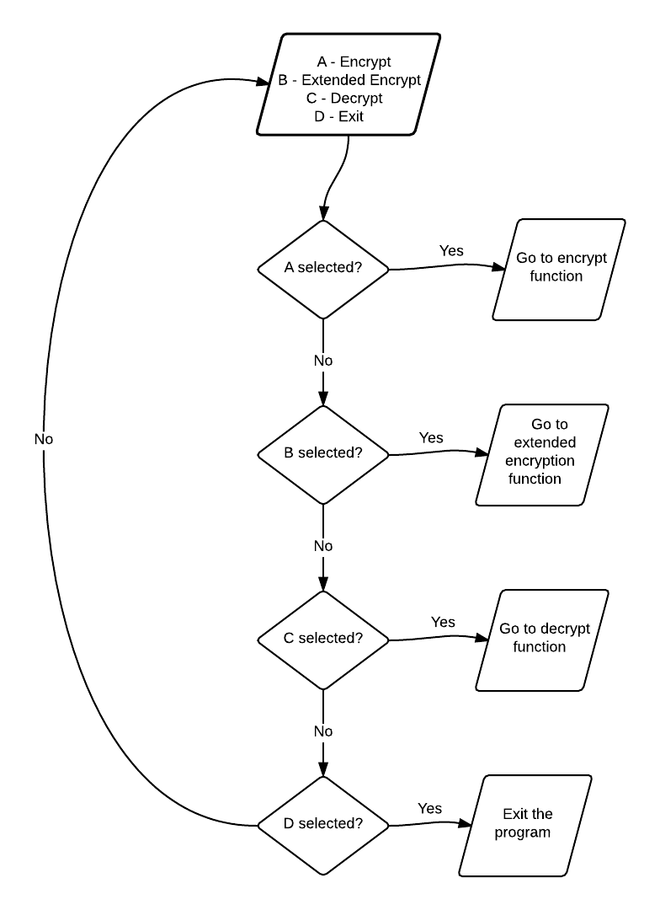

####PsudeoCode
```
FUNCTION mainmenu()
	Choice <-- "NULL"
	choices <-- ["A", "B", "C", "EXIT"]
	##While no choice has been selected
	WHILE UCase(Choice) !=  choices[1..4]
		OUTPUT "Main Menu"
		OUTPUT "A - Encrypt"
		OUTPUT "B - Decrypt"
		OUTPUT "C - Exit"

		##Ask the user to choose an option
		OUTPUT "Please type A,B or C"
		Choice <-- USERINPUT
		Choice <-- UCase(Choice)

		IF Choice = choices[1] THEN
			##Run the encryption function
			Encrypt()
		ELSE IF Choice = choices[2] THEN
		     ##Run the extended encryption function
		    SecureEncrypt()
		ELSE IF Choice = choices[3]  THEN	
			##Run the decrypt function
			Decrypt()
		ELSE IF Choice = choices[4] THEN
			##Ask the user to confirm exiting the program
       		OUTPUT "Are You Sure? [Yes/No]"
			sure <-- USERINPUT
			sure <-- UCase(sure)

       		##If sure is yes exit
       		IF sure = "YES" THEN
       		    OUTPUT "Goodbye"
       		    EXIT
       		ELSE
       		    choice <-- "NULL"
			ENDIF		
	ENDWHILE
ENDFUNCTION
```
####Python
```python
##Function to print the main menu
def mainmenu():
    ## Define choice as null
    choice = "NULL"
    choices = ["A", "B", "C", "D"]
    print ("Main Menu")
    print ("A - Encrypt")
    print ("B - Secure Encrypt")
    print ("C - Decrypt")
    print ("D - Exit")

    ##While no choice has been selected
    while choice != choices:
        choice = input("Please choose and option: ")
        choice = choice.upper()
        if choice == choices[0]:
            encrypt()
        elif choice == choices[1]:
            secureencrypt()
        elif choice == choices[2]:
            decrypt()
        elif choice == choices[3]:

            sure = input("Are You Sure? [Yes/No]")
            sure = sure.upper()
            print (sure)
            if sure == "YES":
                print("Goodbye")
                exit()
            else:
                choice = "NULL"
        else:
            print (choice, "is not recongised")
            print ("Please try again")
            choice = "NULL"

```

This function starts by defining a variable, choice, and sets it to "NULL". Then it defines the main menu function which prints each option the user can perform. Then I have a while loop that checks to see if choice is A, B, C or D.

###Screenshot  
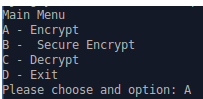

### Read File Contents - Task 2
####Explanation
The ```readfile``` function is used to load the file that the user wants to encrypt / decrypt. The user gets asked the file name, and if the file exists and is a .txt file it will return the text from the file. Otherwise it will print an error message.

####Flowchart  
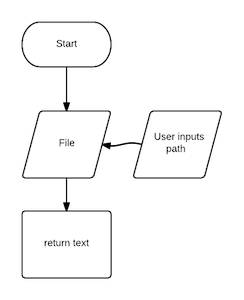  

####PsudeoCode
```
FUNCTION readfile(FileName)
	##Define fileloaded as a boolean and set to false
    fileloaded <-- False
	##Define sure as a string and set to null
    sure <-- "NULL"
	##Set while loop
    WHILE fileloaded = False
		TRY
		    ##Open File with the name the user entered
			f <-- OPEN(FileName)
			##Set text to the file contents
			text <-- READ(file)
			##Close the file
			CLOSE(f)
			##Check to see if the file ends with .txt
			IF FileName ENDSWITH ".txt" THEN
					fileloaded <-- True
					WHILE sure ≠ "YES" OR sure ≠ "NO"
						##Ask the user to confirm the file to open
                    	OUTPUT "Is this the file: " + FileName + "you want to open [Yes /No]"
						sure <-- USERINPUT
						sure <-- UPPERCASE
						IF sure = "YES" OR sure = "Y" THEN
							OUTPUT "File Loaded!"
							##Return the text
							RETURN text
						ELSE IF sure = "NO" or sure = "N" THEN
							fileloaded <-- False
							##Ask the user for the file name
                        	OUTPUT "What file would you like to open?"
							FileName <-- USERINPUT
						ELSE
							OUTPUT "Please enter Yes or No"
						ENDIF
			ELSE
				OUPTPUT "Sorry that file isn't a .txt file. Please try again"
				fileloaded <-- False
				OUTPUT "What file would you like to open?"
				FileName <-- USERINPUT
			ENDIF
		##If there is an error do this
        EXCEPT
			OUTPUT "File Not Found"
			fileloaded <-- False
			OUTPUT  "What file would you like to open?"
			FileName <-- USERINPUT
	ENDWHILE
ENDFUNCTION
```

####Python
``` python
## Function to read a file
def readfile(FileName):
    ##Define fileloaded as a boolean and set to false
    fileloaded = False
    ##Define sure as a string and set to null
    sure = "NULL"
    ##Set while loop
    while fileloaded == False:
        ##Try this
        try:
            ##Open File with the name the user entered
            f = open(FileName, "r")
            ##Set text to the file contents
            text = f.read()
            print(text)
            ##Close the file
            f.close()
            ##Check to see if the file ends with .txt
            if FileName.endswith(".txt"):
                fileloaded = True
                while sure != "YES" or sure != "NO":
                    ##Ask the user to confirm the file to open
                    sure = input("Is this the file: " +  FileName + " you want to open? [Yes / No]")
                    sure = sure.upper()
                    if sure == "YES" or sure == "Y":
                        print ("File Loaded!")
                        ##Return the text
                        return text
                    elif sure == "NO" or sure == "N":
                        fileloaded = False
                        ##Ask the suer for the file name
                        FileName = input("What file would you like to open?")
                    else:
                        print ("Please enter Yes or No")
            else:
               print ("Sorry that file isn't a txt file. Please try again")
               fileloaded = False
               FileName = input("What file would you like to open?")
        ##If there is an error do this
        except:
            print("File Not Found")
            fileloaded = False
            FileName = input("What file would you like to open?")
```
This function starts with passing the ```FileName``` variable from the individual run functions e.g. ```decrypt()``` / ```encrypt()```. Next it sets two variables, ```fileloaded```, which is set to false - used to check if the file has been loaded, and ```sure``` which is set to "NULL", - used when the user is asked to confirm the file they want to open. Then I start a while loop to check if the variable ```FileLoaded``` is false. This means that unless I set ```fileloaded``` to true it will repeat forever. Then I open a try statement which uses the variable ```f``` to open the file and set the content to. The program then sets text to the contents of the file then closes the file. Next the program runs through a series of tests to check if the file is valid. It checks if the file ends with the .txt extension which checks if it is a txt file. Then it asks the user to confirm the file to open. If there is an error at any stage in the program it will ask the user to re-enter a file to open.

###Screenshot
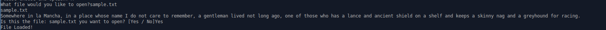

### Generate The Eight Character Key - Task 3
####Explanation
The ```GenerateKey()``` function is use to make the key, used by the program, to make the offset factor. It finds a random number between 33 and 127 and converts it to the equivalent ascii value. It results in an 8 character key. This gets returned to the main function.


####Flowchart
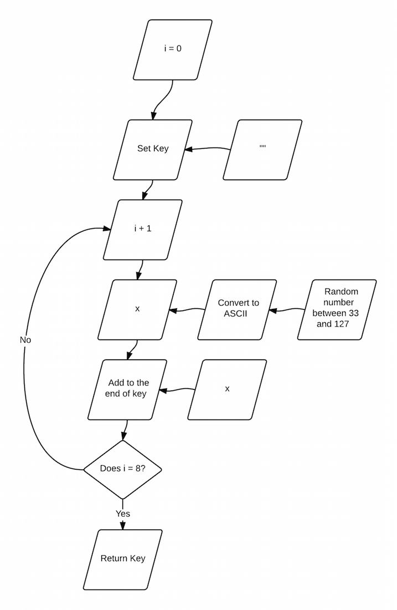

\newpage
####Psudeocode

```
##Define Generate Key Function
FUNCTION GenerateKey()
		key <-- ""
		FOR  i  <-- 1 TO 8
			##Set x to a random number between 33 and 127
        	x <-- GET A RANDOM NUMBER BETWEEN 33 AND 127
			x <-- CHR CONVERT TO ASCII VALUE
		    ##Add it on to the end of the final key string
        	key <--key + x
		ENDFOR
		RETURN key
ENDFUNCTION
```
####Python
```python
def GenerateKey():
	chctkey = ""
	for i in range(8):
			##Set x to a random number between 33 and 127
			x = chr(random.randrange(33,127))
			##Add it on to the end of the final key string
			chctkey += x
	print("CHCT KEY = ",  chctkey)
	return chctkey
```

This function starts by setting the variable ```chctkey``` to "NULL". Then a forloop starts and repeats eight times. Each time the function sets x to the ascii value of a random number between the range 33 and 127. Then it appends the string called chctkey with the value. Then after it does that eight times it returns the finished key to the main running function.

###Screenshot


### Generate The Offset Value - Task 4
####Explanation
The offset factor function uses the key generated from task 3 and calculates the offset factor to be used when encrypting the text. It converts the characters in to the ascii number then it adds them all together. Then it divides the total by 8 and rounds down. Then finally it subtracts 32 and returns the offset value.


####Flowchart
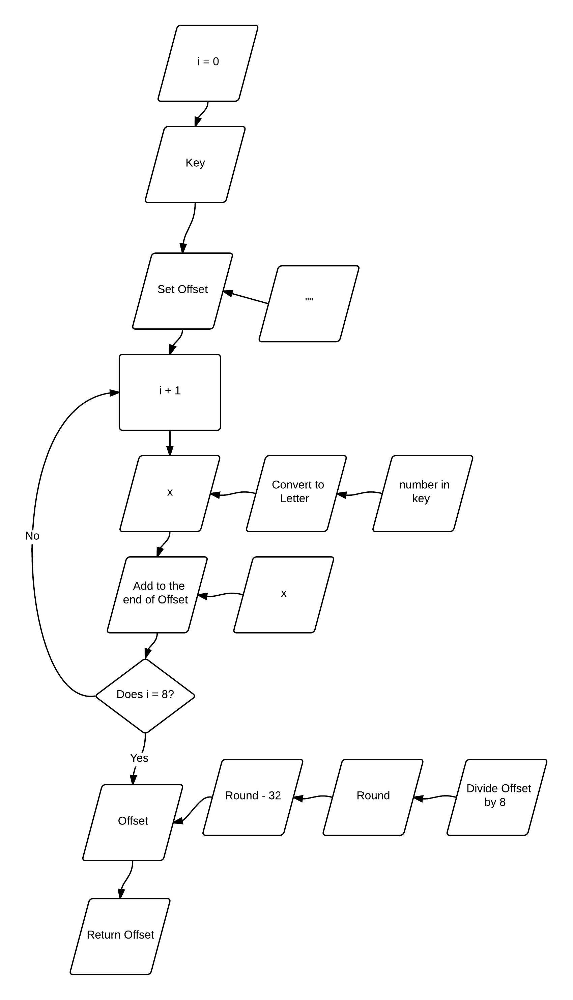

\newpage
####Psudeocode
```
FUNCTION calcoffset(key)
	offset <-- 0
	FOR i <-- 1 TO 8
		##Set x to the ascii value of the character selected
        x <-- key[i]
		x <-- CONVERT TO NUMBER FROM ASCII VALUE
		##Add x to the end  of the offset integer
        offset <-- offset + x
	ENDFOR
	##Devide the total by 8, round it down and minus 32
    offset <-- ROUND offset / 8
	offset <-- offset- 32
	##Return the offset value
    REUTRN offset
ENDFUNCTION
```
####Python
```python
def CalcOffset(key):
    offset = 0
    for i in key:
        ##Set x to the ascii value of the character selected
        x = ord(i)
        ##Add x to the end  of the offset integer
        offset += x
    #Devide the total by 8, round it down and minus 32
    offset = round(offset / 8) - 32
    ##Return the offset value
    return offset
```
This function starts by setting the variable offset as 0 and an integer. Then it starts a for loop for eight times. Then for each character in the variable key it converts it to the ascii value and adds it to the end of the offset string. Then it divides the total value by 8, rounds it down and minuses 32. This then gets returned to the main function.

###Screenshot
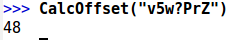

###Encrypts Text - Task 5

####Explanation
The encrypt text function, converts the plain text into encrypted text. It uses the offset factor generated using the key and it also uses the text from the ```readfile``` function. For each character in the imported text it converts to the ascii number, add the offset and then if the result is greater than 126 it will subtract 94 from the total. Then it will convert it back to an ascii character and will add it to the end of the text variable. Then the function will return the encrypted text.


####Flowchart
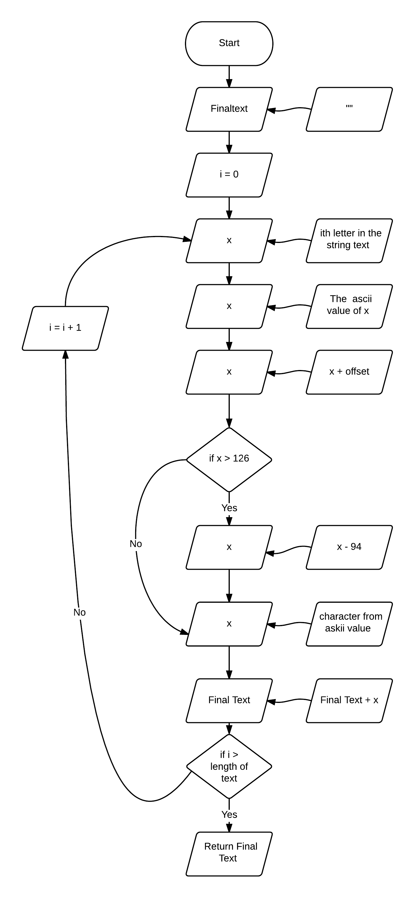

\newpage
####PsudeoCode
```
##Define Encrypt Text Function
FUNCTION EncryptText(text, offset)
	finaltext <-- ""
	##Strip text
	text <-- STRIP(text)
	FOR c IN text
		##Set x to the ascii value of c and add the offset
		x <-- c
		x <-- CONVERT CHARACTER TO ASCII VALUE
		x <-- x + offset
		##Check to see if it is greater than 126
        IF x > 126 THEN
			x <-- x - 94
		END IF
		##Convert the ascii value back to a letter
        x <-- CONVERT VALUE TO CHARACTER
		text <-- text MINUS THE LETTER
		##Add it to the end of the finaltext string
        finaltext <-- finaltext + x
	ENDFOR
	##Return the value of final text
	RETURN finaltext
ENDFUNCTION
```

####Python
``` python
## Define Encrypt Text Function
def EncryptText(text, offset):
    finaltext = ""
    ## Strip text
    text = text.strip()
    for c in text:
        x = c
        ## Check if x is a space
        if x == " ":
            finaltext += " "
        else:
            ##Set x to the ascii value of c and add the offset
            x = ord(c) + offset
            ##Check to see if it is greater than 126
            if x > 126:
                x -= 94
            ##Convert the ascii value back to a letter
            x = chr(x)
            ##Add it to the end of the finaltext string
            finaltext  += x
    ##Return the value of final text
    return finaltext
```
This function starts by setting a new variable called ```finaltext``` to a blank string. Then, it strips the text to only get the text from the file, and it then iterates over each character in the text variable, setting a new temporary variable c as the character. I then set x to c and I start by checking if the character is a space. If so I add it to the end of the finaltext string then I move on into the next character. If the character isn't a space I convert it to it's ASCII value and I add on the offset to that. Then if the value is bigger than 126 (if it isn't a valid letter), the program will minus 94 off of the value to make it a valid ascii letter. Then it converts the ascii value back into a letter and appends that to the end of the string.

###Screenshot
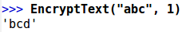

### Save File - Task 6
####Explanation
The save file function is used to save the encrypted text into a new text file. It will ask you for the file name to open and will use the encrypted text from task 5. Then it will write the text to the file then close the file.

####Flowchart
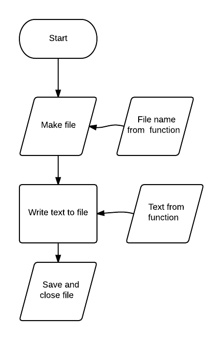


####PsudeoCode
```
##Function to write a file
FUNCTION writefile(FileName, text)
	##Define the boolean filesaved, set it to False
    filesaved <-- False
	WHILE filesaved = False
		##Ask the user for the filename
        OUTPUT "What would you like to save the encrypted file as?"
		FileName <-- USERINPUT
		##If stripped is the value nothing or just the extension
        IF STRIPPED FileName = "" OR STRIPPED FileName = ".txt" THEN
			filesaved <-- False
			OUTPUT "Please enter a valid file name"
		ELSE
			##Check to see if the filename ends with .txt
            IF FileName ENDSWITH ".txt" THEN
				PASS
			ELSE
				##If not add it to the end of the filename.
                FileName <-- FileName + ".txt"
			ENDIF
			TRY
				##Create a file with the name the user entered and set to FileName
                f <-- OPEN(FileName)
				##Write the encrypted text to it
                f.WRITE(text)
				##Close the file
				CLOSE(f)
				OUTPUT "File Written at: " + FileName
				filesaved <-- True
				RETURN
			##If there is an error do this
            EXCEPT
				OUTPUT "Sorry there was an error saving your file. Please try again"
				filesave <-- False
		ENDIF
	ENDWHILE
ENDFUNCTION
```
####Python
```python
## Function to write a files
def writefile(Text):
    ##Define the boolean filesaved, set it to False
    filesaved = False
    while filesaved == False:
        ##Ask the user for the filename
        FileName = input("What would you like to save the encrypted file as? ")
        ##If stripped is the value nothing or just the extension
        if FileName.strip() ==  "" or FileName.strip() == ".txt":
            filesaved = False
            print ("Please enter a valid file name")
        else:
            ##Check to see if the filename ends with .txt
            if FileName.endswith(".txt"):
                pass
            else:
                ##If not add it to the end of the filename.
                FileName += ".txt"
            try:
                ##Create a file with the name the user entered and set to FileName
                f = open(FileName, "w")
                ##Write the encrypted text to it
                f.write(Text)
                ##Close the file
                f.close()
                print("File Written at: " + FileName)
                filesaved = True
                return
            ##If there is an error do this
            except:
                print ("Sorry there was an error saving your file. Please try again")
                filesave = False

```
This functions starts by defining a boolean variable with the value False. Then it starts a while loop while the value is False. Next the user is asked to input the filename, this is then set as a string to the variable FileName. Then the program checks to see if the filename they entered is blank. If so it will ask them again for another file name. If the filename they entered isn't blank, it will check if it ends in the file type ".txt". If it doesn't, the program will add it onto the end of the filename the user entered. Then the program saves the file, with the encrypted text, prints a  confirmation note then sets the filesaved boolean to true. Then it returns the function. If there is an error the program prints and error message and gets the user to save the file again.

###Screenshot
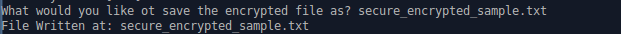

### Open File - Task 7
####Explanation

The ```readfile``` function is used to load the file that the user wants to encrypt / decrypt. The user gets asked the file name, and if the file exists and is a .txt file it will return the text from the file. Otherwise it will print an error message.

####Flowchart


####PsudeoCode
```
FUNCTION readfile(FileName)
	##Define fileloaded as a boolean and set to false
    fileloaded <-- False
	##Define sure as a string and set to null
    sure <-- "NULL"
	##Set while loop
    WHILE fileloaded = False
		TRY
		    ##Open File with the name the user entered
			f <-- OPEN(FileName)
			##Set text to the file contents
			text <-- READ(file)
			##Close the file
			CLOSE(f)
			##Check to see if the file ends with .txt
			IF FileName ENDSWITH ".txt" THEN
					fileloaded <-- True
					WHILE sure ≠ "YES" OR sure ≠ "NO"
						##Ask the user to confirm the file to open
                    	OUTPUT "Is this the file: " + FileName + "you want to open [Yes /No]"
						sure <-- USERINPUT
						sure <-- UPPERCASE
						IF sure = "YES" OR sure = "Y" THEN
							OUTPUT "File Loaded!"
							##Return the text
							RETURN text
						ELSE IF sure = "NO" or sure = "N" THEN
							fileloaded <-- False
							##Ask the user for the file name
                        	OUTPUT "What file would you like to open?"
							FileName <-- USERINPUT
						ELSE
							OUTPUT "Please enter Yes or No"
						ENDIF
			ELSE
				OUPTPUT "Sorry that file isn't a .txt file. Please try again"
				fileloaded <-- False
				OUTPUT "What file would you like to open?"
				FileName <-- USERINPUT
			ENDIF
		##If there is an error do this
        EXCEPT
			OUTPUT "File Not Found"
			fileloaded <-- False
			OUTPUT  "What file would you like to open?"
			FileName <-- USERINPUT
	ENDWHILE
ENDFUNCTION
```

####Python
``` python
## Function to read a file
def readfile(FileName):
    ##Define fileloaded as a boolean and set to false
    fileloaded = False
    ##Define sure as a string and set to null
    sure = "NULL"
    ##Set while loop
    while fileloaded == False:
        ##Try this
        try:
            ##Open File with the name the user entered
            f = open(FileName, "r")
            ##Set text to the file contents
            text = f.read()
            print(text)
            ##Close the file
            f.close()
            ##Check to see if the file ends with .txt
            if FileName.endswith(".txt"):
                fileloaded = True
                while sure != "YES" or sure != "NO":
                    ##Ask the user to confirm the file to open
                    sure = input("Is this the file: " +  FileName + " you want to open? [Yes / No]")
                    sure = sure.upper()
                    if sure == "YES" or sure == "Y":
                        print ("File Loaded!")
                        ##Return the text
                        return text
                    elif sure == "NO" or sure == "N":
                        fileloaded = False
                        ##Ask the suer for the file name
                        FileName = input("What file would you like to open?")
                    else:
                        print ("Please enter Yes or No")
            else:
               print ("Sorry that file isn't a txt file. Please try again")
               fileloaded = False
               FileName = input("What file would you like to open?")
        ##If there is an error do this
        except:
            print("File Not Found")
            fileloaded = False
            FileName = input("What file would you like to open?")
```
This function starts with passing the ```FileName``` variable from the individual run functions e.g. ```decrypt()``` / ```encrypt()```. Next it sets two variables, ```fileloaded```, which is set to false - used to check if the file has been loaded, and ```sure``` which is set to "NULL", - used when the user is asked to confirm the file they want to open. Then I start a while loop to check if the variable ```FileLoaded``` is false. This means that unless I set ```fileloaded``` to true it will repeat forever. Then I open a try statement which uses the variable ```f``` to open the file and set the content to. The program then sets text to the contents of the file then closes the file. Next the program runs through a series of tests to check if the file is valid. It checks if the file ends with the .txt extension which checks if it is a txt file. Then it asks the user to confirm the file to open. If there is an error at any stage in the program it will ask the user to re-enter a file to open.


###Screenshot


### Decrypt Function - Task 8
####Explanation
The decrypt function is used to decrypt encrypted text made by the program. It will use the text imported by the load file function. Then it will convert each character to it's ascii number equivalent. Then it will subtract the offset, calculated by the key that the user entered. Then, if the number is less than 33 it will add 94 onto the total. Then once its done that for each character in the encrypt it will return the plain text.


####Flowchart

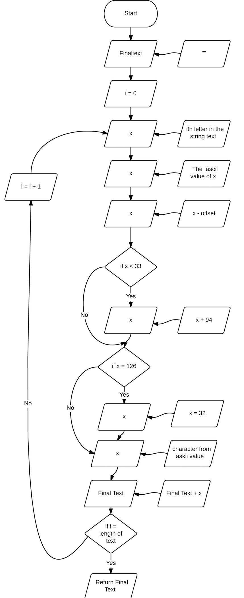

####PsudeoCode
```
FUNCION Decrypt(text, offset)
	finaltext <-- ""
	FOR c in text
		x <-- c
		IF x = " " THEN
			finaltext <-- finaltext + " "
		ELSE
			##Set x to the Converted the string into the ascii value.
            x <-- ASCII VALUE OF x
			##Minus the offset
            x <-- x - offset
			##Check to see if the value is less than 33
            IF x < 33 THEN
				x <-- x + 94
			ENDIF
			##Convert the ascii value back to a string
            x <-- Character OF ASCII VALUE
			##Add the value of x onto the end of the string finaltext.
            finaltext <-- finaltext + x
		ENDIF
	ENDFOR
RETURN finaltext
ENDFUNCTION
```

####Python
```python
## Define the Decrypt Function
def DecryptText(text, offset):
    finaltext = ""
    for c in text:
        x = c
        if x == " ":
            finaltext += " "
        else:
            ##Set x to the Converted the string into the ascii value.
            x = ord(x)
            ##Minus the offset
            x = x - offset
            ##Check to see if the value is less than 33
            if x < 33:
                ##Add 94 on to the string
                x += 94
            ##Convert the ascii value back to a string
            x = chr(x)
            ##Add the value of x onto the end of the string finaltext.
            finaltext  += x
    print(finaltext)
    return finaltext
```
###Screenshot
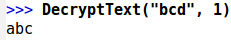

### Print Decrypted Function - Task 9

####Explanation
This function just prints the plain text calculated in task 8.

####Flowchart
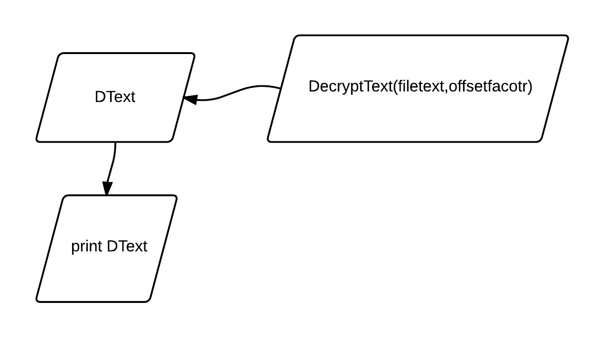

####PsudeoCode
	DText <-- DecryptText(filetext)
	OUTPUT DText

####Python
```python
DText = DecryptText(filetext, offsetfactor)
print(DText)
```
###Screenshot
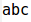

###Extended Encryption - Task 10

####Explanation
The extended encryption function is the function that converts the plain text into encrypted text. It uses the offset factor, generated using the key,as well as using the text from the ```readfile()``` function. It starts by removing all spaces from the text. For each character, in the imported text, it converts to the ascii number, adds the offset and then if the result is greater than 126 it will subtract 94 from the total. Every 5th character, the program will add a space, so the encrypted text will have groups of 5 characters. Then it will convert it back to an ascii character and will add it to the end of the text variable.

####Flowchart
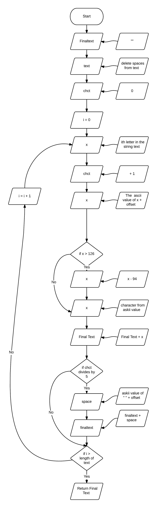

####PsudeoCode
```
## Define Secure Encrypt Text Function
FUNCTION SecureEncryptText(text, offset)
	##Define the empty string final text
    finaltext <-- ""
	##Strip the string variable text
    ##Remove all spaces
    text <-- STRIPPED text
	text <-- REMOVE SPACES
	##Define a new integer variable called chct
    chct <-- 0
	FOR c in text
		chct <-- chect + 1
		##Set x to the ascii value of the character (in c) and add on the offset
        x <-- ASCII VALUE OF X + offset
		##Check to see if the value is greater than 126
        IF x > 126 THEN
			x <-- - 94z
		ENDIF
		##Convert back to a string from the ascii value
        x <-- CHARACTER OF ASCII VALUE
		##Add onto the end  of the finaltext string
        finaltext <-- + x
		##Check if the variable chct, when divided by five is 0.
        IF chct MOD 5 = 0 THEN
		    ##Add a space onto the text
		 	space <-- ASCII VALUE OF " "
			space <-- space + offset
			finaltext <-- + CHARACTER OF SPACE
	ENDFOR
ENDFUNCTION
```
####Python
```python
## Define Secure Encrypt Text Function
def SecureEncryptText(text, offset):
    ##Define the empty string final text
    finaltext = ""
    ##Strip the string variable text
    text = text.strip()
    ##Remove all spaces
    text = text.replace(" ", "")
    ##Define a new integer variable called chct
    chct = 0
    for c in text:
        chct += 1
        ##Set x to the ascii value of the character (in c) and add on the offset
        x = ord(c) + offset
        ##Check to see if the value is greater than 126
        if x > 126:
           x -= 94
        ##Convert back to a string from the ascii value
        x = chr(x)
        ##Add onto the end  of the finaltext string
        finaltext  += x
        ##Check if the variable chct, when divided by five is 0.
        if chct % 5 == 0:
            ##Add a space onto the program
            finaltext += " "
    return finaltext
```
###Screenshot
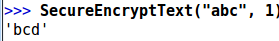

###Full Python Code:
```python
## Import the random module
import random
## Define Generate Key Function
def GenerateKey():
    chctkey = ""
    for i in range(8):
        ##Set x to a random number between 33 and 127
        x = chr(random.randrange(33,127))
        ##Add it on to the end of the final key string
        chctkey += x
    print("CHCT KEY = ",  chctkey)
    return chctkey

##Determine Off set factor
def CalcOffset(key):
    offset = 0
    for i in key:
        ##Set x to the ascii value of the character selected
        x = ord(i)
        ##Add x to the end  of the offset integer
        offset += x
    #Devide the total by 8, round it down and minus 32
    offset = round(offset / 8) - 32
    ##Return the offset value
    return offset

## Define Encrypt Text Function
def EncryptText(text, offset):
    finaltext = ""
    ## Strip text
    text = text.strip()
    for c in text:
        x = c
        ## Check if x is a space
        if x == " ":
            finaltext += " "
        else:
            ##Set x to the ascii value of c and add the offset
            x = ord(c) + offset
            ##Check to see if it is greater than 126
            if x > 126:
                x -= 94
            ##Convert the ascii value back to a letter
            x = chr(x)
            ##Add it to the end of the finaltext string
            finaltext  += x
    ##Return the value of final text
    return finaltext

## Define Secure Encrypt Text Function
def SecureEncryptText(text, offset):
    ##Define the empty string final text
    finaltext = ""
    ##Strip the string variable text
    text = text.strip()
    ##Remove all spaces
    text = text.replace(" ", "")
    ##Define a new integer variable called chct
    chct = 0
    for c in text:
        chct += 1
        ##Set x to the ascii value of the character (in c) and add on the offset
        x = ord(c) + offset
        ##Check to see if the value is greater than 126
        if x > 126:
           x -= 94
        ##Convert back to a string from the ascii value
        x = chr(x)
        ##Add onto the end  of the finaltext string
        finaltext  += x
        ##Check if the variable chct, when divided by five is 0.
        if chct % 5 == 0:
            ##Add a space onto the program
            finaltext += " "
    return finaltext

## Define the Decrypt Function
def DecryptText(text, offset):
    finaltext = ""
    for c in text:
        x = c
        if x == " ":
            finaltext += " "
        else:
            ##Set x to the Converted the string into the ascii value.
            x = ord(x)
            ##Minus the offset
            x = x - offset
            ##Check to see if the value is less than 33
            if x < 33:
                ##Add 94 on to the string
                x += 94
            ##Convert the ascii value back to a string
            x = chr(x)
            ##Add the value of x onto the end of the string finaltext.
            finaltext  += x
    print(finaltext)
    return finaltext

## Function to write a files
def writefile(Text):
    ##Define the boolean filesaved, set it to False
    filesaved = False
    while filesaved == False:
        ##Ask the user for the filename
        FileName = input("What would you like to save the encrypted file as? ")
        ##If stripped is the value nothing or just the extension
        if FileName.strip() ==  "" or FileName.strip() == ".txt":
            filesaved = False
            print ("Please enter a valid file name")
        else:
            ##Check to see if the filename ends with .txt
            if FileName.endswith(".txt"):
                pass
            else:
                ##If not add it to the end of the filename.
                FileName += ".txt"
            try:
                ##Create a file with the name the user entered and set to FileName
                f = open(FileName, "w")
                ##Write the encrypted text to it
                f.write(Text)
                ##Close the file
                f.close()
                print("File Written at: " + FileName)
                filesaved = True
                return
            ##If there is an error do this
            except:
                print ("Sorry there was an error saving your file. Please try again")
                filesave = False

## Function to read a file
def readfile(FileName):
    ##Define fileloaded as a boolean and set to false
    fileloaded = False
    ##Define sure as a string and set to null
    sure = "NULL"
    ##Set while loop
    while fileloaded == False:
        ##Try this
        try:
            ##Open File with the name the user entered
            f = open(FileName, "r")
            ##Set text to the file contents
            text = f.read()
            print(text)
            ##Close the file
            f.close()
            ##Check to see if the file ends with .txt
            if FileName.endswith(".txt"):
                fileloaded = True
                while sure != "YES" or sure != "NO":
                    ##Ask the user to confirm the file to open
                    sure = input("Is this the file: " +  FileName + " you want to open? [Yes / No]")
                    sure = sure.upper()
                    if sure == "YES" or sure == "Y":
                        print ("File Loaded!")
                        ##Return the text
                        return text
                    elif sure == "NO" or sure == "N":
                        fileloaded = False
                        ##Ask the suer for the file name
                        FileName = input("What file would you like to open?")
                    else:
                        print ("Please enter Yes or No")
            else:
               print ("Sorry that file isn't a txt file. Please try again")
               fileloaded = False
               FileName = input("What file would you like to open?")
        ##If there is an error do this
        except:
            print("File Not Found")
            fileloaded = False
            FileName = input("What file would you like to open?")

##Function to print the main menu
def mainmenu():
  	choice = "NULL"
	  print ("Main Menu")
    print ("A - Encrypt")
    print ("B -  Secure Encrypt")
    print ("C - Decrypt")
    print ("D - Exit")

		##While no choice has been selected
		while choice != "A" or choice != "B" or choice != "C":
		    mainmenu()
		    ##Ask the user to choose an option
		    choice = input("Please choose and option: ")
		    choice = choice.upper()
		    if choice == "A":
		        ##Run the encryption function
		        encrypt()
		    elif choice == "B":
		        ##Run the extended encryption function
		        secureencrypt()
		    elif choice == "C":
		        ##Run the decrypt function
		        decrypt()
		    elif choice == "D":
		        ##Ask the user to confirm exiting the program
		        sure = input("Are You Sure? [Yes/No]")
		        sure = sure.upper()
		        ##If sure is yes exit
		        if sure == "YES":
		            print("Goodbye")
		            exit()
		        else:
		            choice = "NULL"
		    else:
		        print (choice, "is not recongised")
		        print ("Please try again")
		        choice = "NULL"

## Main Encrypt Function
def encrypt():
    ##Ask the use for the filename
    filename = input("What file would you like to open?")
    ##Read the file and set the contents to filetext
    filetext = readfile(filename)
    ##Generate the key to encrypt the text
    key = GenerateKey()
    print ("Your Key Is: ", key)
    print ("Do Not Forget This Key")
    ##Generate the offset value from the key
    offsetfactor = CalcOffset(key)
    ##Encrypt the text and set the returned text to EText
    EText = EncryptText(filetext, offsetfactor)
    ##Write the encrypted text to a file
    writefile(EText)

def secureencrypt():
    ##Ask the user for the filename to read from
    filename = input("What file would you like to open?")
    ##Read the file and set the contents to filetext
    filetext = readfile(filename)
    ##Generate the key to encrypt the text
    key = GenerateKey()
    print ("Your Key Is: ", key)
		print ("Do not forget this key")
    ##Generate the offset value form the key
    offsetfactor = CalcOffset(key)
    ##Use the extended encryption function to encrypt the text
    SEText = SecureEncryptText(filetext, offsetfactor)
    ##Write the encrypted text to a file
    writefile(SEText)

## Main Decrypt Function
def decrypt():
    ##Ask the user for the filename to read from
    filename = input("What file would you like to open?")
    ##Read the file and set the contents to filetext
    filetext = readfile(filename)
    ##Ask the user for the key they used to encrypt the text
    key = input("What key was used to encrypt this text?")
    ##Generate the offset value form the key
    offsetfactor = CalcOffset(key)
    ##Decrypt the text and set it to the variable DText
    DText = DecryptText(filetext, offsetfactor)
    print (DText)

mainmenu()
```

##Programming Techniques
###Loops
####For Loop
#####Explanation
A forloop is used to loop for a certain or fixed number of times. For example 5 times or for every letter in a string. This is a different type of loop to a while loop because while loop is used until a certain condition is met.

#####Example
    for i in range(0,5)
        print ("Hello World")
#####Result
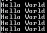

\newpage

#####Pros/Cons
For loops in python are good for looping through strings or lists in python because it sets a temporary variable with the iteration data, and it's more efficient then using a while loop because you don't need to set any other variables to use it. However forloops can be replaced with the inbuilt map function or list comprehensions for cleaner looking code and more verbose output

#####When I used it
I used for loops at various points throughout my program. I mainly used them to iterate over a string for encrypting and decrypting each character. I also used it to generate the eight character key and to calculate the offset factor:

```python
	for i in key:
		##Set x to the ascii value of the character selected
		x = ord(i)
		##Add x to the end  of the offset integer
		offset += x
	#Devide the total by 8, round it down and minus 32
	offset = round(offset / 8) - 32

```

####While Loop
#####Explanation
A while loop is used to loop until a condition is met. For example; ```while Run == True```. It isn't used as frequently as a for loop because it is less powerful.

#####Example
    while run == True:
        print("Hello World")

This will run for ever until I set `run = False`.

#####Pros/Cons
While loops can be run for an infinite number of repeats and can only carry on once a condition is met, this is useful to make your code more robust when a user enters data, however, a while loop requires a variable to run which means that your adding more variables that may only be used once.

#####When I used it
I mainly used while loops in my code for when a user enters data, it was used to make my code more robust because if a user enters incorrect data, they would be asked them to input it again. For example I used a while loop in my read file function:

```python
while fileloaded == False:
		##Try this
		try:
			##Open File with the name the user entered
			f = open(FileName, "r")
			##Set text to the file contents
			text = f.read()
			print(text)
			##Close the file
			f.close()
			##Check to see if the file ends with .txt
			if FileName.endswith(".txt"):
					fileloaded = True
					while sure != "YES" or sure != "NO":
							##Ask the user to confirm the file to open
							sure = input("Is this the file: " +  FileName + " you want to open? [Yes / No]")
							sure = sure.upper()
							if sure == "YES" or sure == "Y":
									print ("File Loaded!")
									##Return the text
									return text
							elif sure == "NO" or sure == "N":
									fileloaded = False
									##Ask the suer for the file name
									FileName = input("What file would you like to open?")
							else:
									print ("Please enter Yes or No")
			else:
				print ("Sorry that file isn't a txt file. Please try again")
				fileloaded = False
				FileName = input("What file would you like to open?")
		##If there is an error do this
		except:
			print("File Not Found")
			fileloaded = False
			FileName = input("What file would you like to open?")
```


###Conditionals
#### IF Statements
#####Explanation
An if statement has three parts: If, Else (optional) and elif (optional). An if statement is used to check two pieces of data. For example: if input = "hello".

#####Example
```python
##If age is 5
if age == 5:
    print ("Your Age Is Five")
elif age > 5:
    print ("You Age Is Greater Than Five")
else:
    print ("Your Age Is Less Than Five")
```
This code starts by checking if the integer variable age is 5, if age = 5 the program will the output the message "Your Age Is Five", next if age isn't 5 the program will check if it is greater than 5, if so it will output the message "Your Age is Greater Than Five". Then if age isn't equal to five or greater than five the program will output the message "Your Age Is Less Than Five".

#####When I used it
I used if statements to check data. For example I first used an if statement in the main menu to check which option the user chose:

```python
if choice == "A":
		encrypt()
elif choice == "B":
		secureencrypt()
elif choice == "C":
		decrypt()
elif choice == "D":
```

###Errors And Exceptions
#### Try and except
#####Explanation
The try and except code blocks are used to handle errors and exceptions. The program starts by using the code inside the try block, if that works and doesn't have and errors or exceptions the program will carry on and ignore the except block, but if there is an error or exception the program will switch and use the code inside the except block.

#####Example
```python
while True:
    try:
        number = int(input("Please enter a number"))
    except:
        print("I'm sorry please enter a valid number")
```

#####Pros
Using try and except statements means I don't have to write multiple if statements to handle errors occurring in the program due to user error.

#####When I used it
I used try and except statements when users entered any data, for example, in the readfile function when the user entered the filename, if the file didn't exists the program will go to the except block.

```python
try:
		##Open File with the name the user entered
		f = open(FileName, "r")
		##Set text to the file contents
		text = f.read()
		print(text)
		##Close the file
		f.close()
		##Check to see if the file ends with .txt
		if FileName.endswith(".txt"):
				fileloaded = True
				while sure != "YES" or sure != "NO":
						##Ask the user to confirm the file to open
						sure = input("Is this the file: " +  FileName + " you want to open? [Yes / No]")
						sure = sure.upper()
						if sure == "YES" or sure == "Y":
								print ("File Loaded!")
								##Return the text
								return text
						elif sure == "NO" or sure == "N":
								fileloaded = False
								##Ask the user for the file name
								FileName = input("What file would you like to open?")
						else:
								print ("Please enter Yes or No")
		else:
			print ("Sorry that file isn't a txt file. Please try again")
			fileloaded = False
			FileName = input("What file would you like to open?")
##If there is an error do this
except:
		print("File Not Found")
		fileloaded = False
		FileName = input("What file would you like to open?")
```

####Chr()
#####Explanation
Chr is an inbuilt function in python and is used to convert an ascii number into a string. The argument given to ```chr()``` has to be an integer & between 0 and 255.

#####Example
```python
print(chr(97))
```

The output for this snipped would be "a"

#####Pros/Cons
It's more efficient than having a dictionary of each letter with a corresponding ascii value, however, it would be more useful if you could enter more than one character at a time.

#####When I used it
I used the ```chr()``` function when I was encrypting and decrypting text, to convert the encrypted characters back to strings, and the input text but also when I was generating the key. For example I used the chr function in the encrpyt text function:

```python
##Convert the ascii value back to a string
x = chr(x)
##Add the value of x onto the end of the string finaltext.
finaltext  += x
```


####Ord()
#####Explanation
Ord is an inbuilt function to convert a character to its equivalent ascii integer. The function can only take a single character at a time.

#####Exmaple
```python
print(ord("a"))
```
The output would be 97 for this code snippet

#####Pros/Cons
It's more efficient than having a dictionary of each letter with a corresponding ascii value, however, it would be more useful if you could enter more than one character at a time.

#####When I used it
I used the ```ord()``` function to convert each character of the text to encrypt and when I decrypted text. For example, I used the ```ord``` function in the decrypt text function:

```python
x = ord(c)
##Minus the offset
x = x - offset
```

####Input()
#####Explanation
```Input()``` is an inbuilt function used to take a keyboard input from the user and use it in the program.

#####Example
```python
	print(input("Hello what is you name?"))
```

If I entered Edward the console would output "Edward"

#####When I used it
I used the input function a lot in this program to allow the user to enter data. I used it in the main menu function - to select which option the user wants to use, the writefile function - to name the file they want to save, the readfile function - to select which file the user want to open:

```python
FileName = input("What file would you like to open?")
```

####Functions
#####Explanation
Functions are blocks of codes that can be called from anywhere in the program. It can be used to repeat code blocks, usually containing algorithms, that can be used more than once. This can make code more robust and efficient. They also allow for local variables to be set in the function, this makes code more efficient as every function doesn't need to access the same variables and increases robustness.

#####Example
```python
def add(num1, num2):
	total = num1 + num2
	return total

def divide(num1, num2):
	total = num1 / num2
	return total

print(add(1, 5))
#This will output 6

print(divide(10, 2))
#This will output 5
```

#####Pros/Cons
Functions allow and an easy way of splitting your code up into sections, as well as making code more efficient and robust because you can use the same set of code multiple times. However some people may find them problematic because it means your code may not be in the order it's run.

#####When I used it
Every block of code I wrote is in a function. This allows me to repeat the same task with out re-coding it as  separate events. It also makes my code more efficient.

####Variables
#####Explanation
Variables are used to store data, there are five primitive data types they can store ways; a character (a single character), a string (a group of character), an integer (a whole number), a float (a decimal number) and a boolean (True or False). There are two types of variables: global variables - can be accessed from any line in the program and local variables - can only be accessed from inside the local scope e.g. Function Scope.

#####Example
```python

#Defines a character
a = "a"

#Defines a String
hello = "Hello World"

#Defines an integer
number = 4

#Defines a float
decimal = 0.58
#Sets a boolean
Loaded = True

print(a)
#Outputs a

print(hello)
#Outputs Hello World

print(number)
#Output 4

print(decimal)
#Outputs 0.58

print(Loaded)
#Outputs True
```

#####Pros/Cons
Variables are useful as they allow you to access data throughout the program, however, the more variables in a program the more memory the program uses.

#####When I used it
I used variables all the time in my program to access data. I also used it in while statements, for example, in the ```readfile()``` function, I used the variable ```FileLoaded``` to determine when the while loop should finish:

```python
fileloaded = False
while fileloaded == False:
```

###How Functions Work Together
In this program all my code is split up into functions to do specific tasks.


#####Functions Needed

| Function Name      | Description                                                                                                                                                             | Arguments | Returned Data |           
| ------------------ | --------------------------------       | --------- | ------------- |           
| mainmenu           | Prints the menu options and allow the user to input their choice                                                                                                        | -         | -             |           
| GenerateKey        | Generates a random 8 character string, used to calculate the offset                                                                                                     | -         | chctkey       |           
| CalcOffset         | Calculates the offset value using the 8 character key, entered in the GenerateKey Function                                                                              | key       | offset        |           
| EncryptText        | Encrypts each character of the string to encrypt by adding the offset value of each character to the ascii value and converts it back to an ascii character.             | offset    & text          | finaltext | 
| SecureEncryptText  | Encrypts each character of the string to encrypt	by adding the offset value of each character to the ascii value and converts it back to an ascii character and groups them into groups of 5. | offset    & text          | finaltext |
| DecryptText        | Decrypts each character of the string to decrypt by removing the offset value of each character from the ascii value	 and converts it back to an ascii character offset  & text      | finaltext     |           
| writefile          | Writes the encrypted data pto a file with a file name specified by the user                                                                               | text      | -             |           
| readfile           | Reads the contents of a text file specified by the user                                                                                                                 | Filename  | text          |           
| encrypt            | Runs all the encryption functions in order                                                                                                                              | -         | -             |           
| secureencrypt      | Runs all the extended encryption functions in the right order                                                                                                           | -         | -             |           
| decrypt            | Runs all the decrypt functions in the right order                                                                                                                       | -         | -             |           


```python
def mainmenu():
    choice = "NULL"

    print ("Main Menu")
    print ("A - Encrypt")
    print ("B -  Secure Encrypt")
    print ("C - Decrypt")
    print ("D - Exit")

    while choice != "A" or choice != "B" or choice != "C":
        choice = input("Please choose and option: ")
        choice = choice.upper()
        if choice == "A":
            encrypt()
        elif choice == "B":
            secureencrypt()
        elif choice == "C":
            decrypt()
        elif choice == "D":

            sure = input("Are You Sure? [Yes/No]")
            sure = sure.upper()
            print (sure)
            if sure == "YES":
                print("Goodbye")
                exit()
            else:
                choice = "NULL"
        else:
            print (choice, "is not recongised")
            print ("Please try again")
            choice = "NULL"
```

The ```mainmenu``` function uses user input and conditionals to call other functions to run each option. So if the chooses choice 'A' the program calls the encrypt function, B the decrypt function etc. None of these function calls need any data.

Then for each of the three tasks the program needs to do, there are separate managing functions:

####Encrypt
This encrypt function is used to manage all the encryption tasks needed to encrypt text. This allows me to run the function call I need and pass data between functions from one main function. Firstly the function asks the user to enter the filename of the file to open.
```python
filename = input("What file would you like to open?")
```

Then it calls the readfile function and uses the filename variable set the line before, as an argument. This reads the file and returns the text which is then set to the variable file text. 

```python
filetext = readfile(filename)
```

Then the managing function calls the GenerateKey function and sets it as the variable called key, which is used in the next function call which calculates the offset to use in the next function call. 
```python
key = GenerateKey()
print ("Your Key Is: ", key)
print ("Do Not Forget This Key")
offsetfactor = CalcOffset(key)
```
 Then the managing function runs the main EncryptText function with the arguments: filetext - from the start of the managing function and the offset factor - from the last function call. Then the final line calls the write file function using the returned data from the previous function call to write in the file.

```python
EText = EncryptText(filetext, offsetfactor)
writefile(EText)
```


####Extended Encrypt
This secureencrypt function is used to manage all the encryption tasks needed to extended encrypt the text. This allows me to run the function call I need and pass data between functions from one main function. Firstly the function asks the user to enter the filename of the file to open.
```python
filename = input("What file would you like to open?")
```

Then it calls the readfile function and uses the filename variable set the line before, as an argument. This reads the file and returns the text which is then set to the variable file text. 

```python
filetext = readfile(filename)
```

Then the managing function calls the GenerateKey function and sets it as the variable called key, which is used in the next function call which calculates the offset to use in the next function call. 
```python
key = GenerateKey()
print ("Your Key Is: ", key)
print ("Do Not Forget This Key")
offsetfactor = CalcOffset(key)
```
 Then the managing function runs the main EncryptText function with the arguments: filetext - from the start of the managing function and the offset factor - from the last function call. Then the final line calls the write file function using the returned data from the previous function call to write in the file.

```python
SEText = ExtendedEncryptText(filetext, offsetfactor)
writefile(SEText)
```


####Decrypt
This decrypt function is used to manage all the decrypt tasks needed to decrypt text. This allows me to run the function call i need and pass data between functions from one main function. Firstly the function asks the user to enter the filename of the file to open. Then it calls the readfile function and uses the filename variable set the line before, as an argument. This reads the file and returns the text which is then set to the variable file text. 
```python
filename = input("What file would you like to open?")
filetext = readfile(filename)
```

Next the program asks the user to enter the key that was used to encrypt the text in the file and sets it as the variable called key, which is used in the next function call which calculates the offset to use in the next function call. 
```python
key = input("What key was used to encrypt this text?")
offsetfactor = CalcOffset(key)
```

Then the managing function runs the main decrypt function with the arguments: filetext - from the start of the managing function and the offset factor - from the last function call. Then the final line calls the write file function using the returned data from the previous function call to print the decrypted text.

```python
DText = DecryptText(filetext, offsetfactor)
print (DText)
```

###Efficiency
In my program I coded as efficiently as I could. I haven't used __global variables__ so extra space on the ram isn't used up by storing the global variables. So if I wanted to pass my data between functions I only passed it to the functions I needed to. All my code is separated into functions so code isn't repeated and all variables are local to each function. This means that if i need to use the same function twice I can call it wherever I need it without writing the same code out multiple times. For example in my encrypt, extended encryption and decrypt functions I called the read file function:

```python
filetext = readfile(filename)
```
I've also used += operators instead of repeating out variable names multiple times. This makes writing my code more efficient than the efficiency for the code running. Another way I made my code more efficient was by using external modules in my program. I used the Random module to generate the numbers to use in the key. This saved me from writing another whole function to generate the random number, instead I can use a pre-made function in the module.

Another way of making my code more efficient was by using external modules in my program. In this program I used one external module which was the random module. This module allows you to generate a random number. This has made my code more efficient because it meant that I haven't had to make my own function, meaning that there is less chance of it not being truly random which is crucial in the encryption process. I used this modules to generate the random ascii values to make up the key, because the key is used to calculate the offset factor of which to encrypt the text by it is vital its truly random. 

```python
import random
```
This code snipped is used to import the random module to use it inside my program. 


```python
x = chr(random.randrange(33,127))
```

This code uses the random module by assigning the variable x, as a string, to the ascii character of a random number between the range of 33 and 127.

Using inbuilt functions was another way of making my code more efficient because it meant that I didn't have to produce and develop ways of doing each inbuilt function I needed. For example I would have had to have made a way to print to the console but due to the inbuilt functions I could just use the print() function. Another example is the ord function. If it wasn't an inbuilt function I would have had to make a way of converting a character into the ascii value by using dictionaries, this would have made my code less efficient because I would have had to have made hundreds of extra functions.

Some inbuilt functions:
```python
	print("Hello World")
	input("Please enter a number")
	round(5/2)
```

In my program I had to use the inbuilt function `chr` to convert ascii values to character but instead of using this inbuilt function I could have used my own algorithm with my own dictionary to convert the text.

```python
mychr = {97:"a", 98:"b", 99:"c", 100:"d", 101:"e", 102:"f"}


#How to get a
print(mychr[97])

#Print the letter assigned to the value of 101
print(mychr[101])
```

By doing this I have full control of how the conversion between the letters and integers would work, however this makes it really inefficient because using the dictionary is most likely slower than using the inbuilt function it also means that your wasting time and reinventing the wheel.

###Data Structures
In this task I have only really needed to use variables and file storage to store and use data. All data used in the program has been stored in variables whether that has been a boolean, an integer or a string. 

I have only used the file data structure when I read and saved  encrypted data so the user could access it outside of the program. The text files that I have used in this program are encoded in UFT-8 which is the industry standard which is binary data that encodes the strings of characters. Saving data as files means that the data is persistent even after I've exited the program and even after I turn off the computer. 

Instead of reading files with UFT-8 I could have read the binary straight from the file. This means that I would be able to encrypt images and any other files types but as I only needed to read and edit 
text files I didn't read the binary.

This would allow me to read UFT-8 or ascii encoded files:
```python
f = open(test.txt, "r")
```

This would allow me to read the binary of files:
```python
f = open(test.png, "rb")
```

Variables - To be used inside the program to store data required by different functions and actions
Files - To store data for use outside of this program

The majority of variables I used were strings. Strings are traditionally a sequence of characters and storing it as a variable means it can be easily mutated. I stored the text to be encrypted from the text file in a string. All strings use UTF-8 encoding by default in python3.

By setting strings to variables I was easily able to manipulate strings. For example I used the ```stip()``` in-built function to remove new lines from the end of my strings.

```python
text = text.strip()
```

\newpage


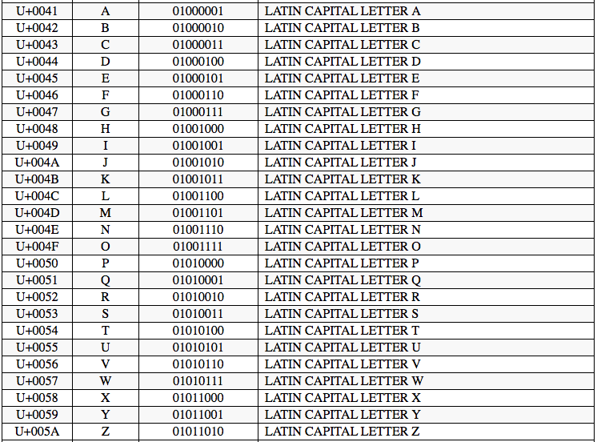
For example here is a list of UFT-8 characters with their associated binary code (www.utf8-chartable.de).

List - Lists allow me to collect multiple elements together in a single container. This allows me to easily mutate my data, creating an easy way to sort, index, count and edit the list as well as elements inside the list. It also is useful for looping through different elements to check in a for or while loop. For example:

```python
def mainmenu():
	choice = "NULL"
	choices = ["A","B", "C"]
    print ("Main Menu")
    print ("A - Encrypt")
    print ("B - Secure Encrypt")
    print ("C - Decrypt")
    print ("D - Exit")

	while choice != choices:
	    
	    choice = input("Please choose and option: ")
	    choice = choice.upper()

	    if choice == choices[0]:
	        encrypt()
	    elif choice == choices[1]:
	        decrypt()
	    elif choice == choices[2]:
	        print("Goodbye")
	        exit()
	    else:
	        choice = "NULL"
```

I used the list choices as a reference for the program to check if what the user entered is in the list. If so the program will run the corresponding code to run the function. instead of using a list I could have used a dictionary because this would allow me to skip the if statement section by being able to run the function that corresponds to the input from the user. Also i could have used a tuple which would have a similar effect to the dictionary but also would be immutable meaning that it would be able to change throughout the program running.


###Robustness

Throughout my program I have added methods to make my code robust. This means that even if the user doesn't enter the right data into the program, the program will not crash and will handle the occurrence. To make my code robust I have used various techniques like while loops and try and excepts.

####If Statements
By using If statements I was allowed to check if data was the right kind or the right length, allowing me to make my code more robust by stopping errors caused by the user entering wrong types of data. For Example:

When the user entered a filename I checked if the file was the right type using this line of code:
```python
if FileName.endswith(".txt"):
```
This allowed me to stop the programming crashing due to the user entering a wrong file type - not a .txt file.

####While Loops
To make portions of my code robust I have used  a lot of while loops, mainly when the user is asked to enter data. This allows me to check if the input is relevant and correct. If so the code carries on however if the input is incorrect the program will respond with an error message and ask the user to try again. This prevents program crashes when the user enters wrong data.
For example:

```python
while choice != "A" or "B" or "C":
		mainmenu()
		choice = input("Please choose and option: ")
		choice = choice.upper()

		if choice == "A":
				encrypt()
		elif choice == "B"
			  extendedencrypt()
		elif choice == "C":
				decrypt()
		elif choice == "D":
				print("Goodbye")
				exit()
		else:
				choice = "NULL"
```
This meant that even if the input from the user isn't a valid input the program won't crash and will ask the user to run again.

####Try And Except
Another way I made my code robust is by using try and except. Using try and except allows the program to handle any errors without crashing. For example when I used try and except in my readfile function, the code would try to read the file but if the file doesn't exist the try and except allowed the program not to crash and to produce an error message and ask the user to enter the filename again. In python the try and except functions can also have custom error handling which allows you to run different code blocks depending on what the error was. For example:

```python
try:
	f = open(FileName, "r")
	str = f.read()
	f.close()
	int(str)
except IOError as e:
    print "Could not open file."
except ValueError:
    print "Could not convert data to an integer."
```

This code is used so that if the error is related to opening the file the 1st except block will run, but if however the the error is because the string isn't convertible to an integer the 2nd except block will run. There is also the ability to add an else clause to the try and except when used like this, which allows the program to run the else block if the error doesn't match any other except blocks. 

For Example I used the try and except code block when the user enters the filename so that if the file doesn't exists the file doesn't crash:
```python
def readfile(FileName):
	print(FileName)
	fileloaded = False
	sure = "NULL"
	while fileloaded == False:
		try:
			f = open(FileName, "r")
			text = f.read()
			print(text)
			f.close()
			if FileName.endswith(".txt"):
				fileloaded = True
				while sure != "YES" or sure != "NO":
					sure = input("Is this the file: " +  FileName + " you want to open? [Yes / No]")
					sure = sure.upper()
					if sure == "YES" or sure == "Y":
						print ("File Loaded!")
						return text
					elif sure == "NO" or sure == "N":
						fileloaded = False
						FileName = input("What file would you like to open?")
					else:
						print ("Please enter Yes or No")
			else:
				print ("Sorry that file isn't a txt file. Please try again")
				fileloaded = False
				FileName = input("What file would you like to open?")
		except:
			if FileName.endswith(".txt"):
				print("File Not Found")
			else:
				print ("Sorry that file isn't a txt file. Please try again")
			fileloaded = False
			FileName = input("What file would you like to open?")
```

####Variables
I haven't used any global variables in my project I've only used local variables. I've only used local variables because global variables make the application more vulnerable due to the fact that multiple functions are changing and using the same variable which would lead to unexpected results and bugs. 


####External Modules
For this application I used one external module which was the random module. This module allows you to generate a random number. This has made my code more robust because it meant I haven't had to make my own function, meaning that there is less chance of it not being truly random which is crucial in the encryption process. By using a module it also meant that the code will be more robust because other people have made and tested it. I used this modules to generate the random ascii values to make up the key, because the key is used to calculate the offset factor of which to encrypt the text by it is vital its truly random. 

```python
import random
```
This code snipped is used to import the random module to use it inside my program. 


```python
x = chr(random.randrange(33,127))
```

This code uses the random module by assigning the variable x, as a string, to the ascii character of a random number between the range of 33 and 127.

####Inbuilt Functions
To write this program I used the language python which has hundreds of inbuilt functions, for example, ord, chr, input, print. All of these functions are build into the language. This means that I don't need to write each function myself this is useful for a few reasons; Firstly it makes my code more efficient because I have to write less, it makes my code more robust because there is no chance of me making a mistake when writing each function, it means I don't have to write out all the functions myself and there wont be any errors. I used inbuilt functions every time I asked the user to input data or every time I printed something to the console.

For example I used the inbuilt function `chr` to convert ascii values to characters. Instead of using this inbuilt function I could have made my own dictionary with the ascii values in.

```python
mychr = {97:"a", 98:"b", 99:"c", 100:"d", 101:"e", 102:"f"}


#How to get a
print(mychr[97])

#Print the letter assigned to the value of 101
print(mychr[101])
```

By doing this I have full control of how the conversion between the letters and integers would work, however this makes it really un-robust and vulnerable because unlike the `chr()` inbuilt function my conversion method doesn't have error handling for an invalid input. I could have made a mistake when writing the dictionary which could  contain all possible characters for example symbols like `%` and `/`.

##Testing
### Main Menu Function
####Description
-The main menu function is used to select what the user wants to do. The only inputs it recognizes are a, b or c. If the user input doesn't equal a, b or c the user gets returned an error and asked to try again.

####Input Tests


| No. |   Function    |           Description          				     |  Data  |      Expected Result     | Pass/Fail |
| --- | --------- | -------------------| --------- | ----------------------- | --------- |
| 001 |   Menu        | Select a menu option       									 |    A   |   Load Encrypt Function |   Pass    |
| 002 |   Menu        | Select a menu option       									 |    B   |   Load Extended Encrypt Function |   Pass    |
| 003 |   Menu        | Select a menu option       									 |    C   |   Load Decrypt Function |   Pass    |
| 004 |   Menu        | Select a menu option       									 |    D   |   Asks to confirm exit  |   Pass    |
| 005 |   Menu        | Enter an unsupported Value   								 |    K   |   Produced an error message; Asks User to try again |   Pass    |
| 006 |   Menu        | Enter an unsupported Value   								 |    1   |   Produced an error message; Asks User to try again |   Pass    |
| 007 |   Menu        | Enter an unsupported Value   								 |    /   |   Produced an error message; Asks User to try again |   Pass    |
| 008 |   Menu        | Enter an unsupported Value   								 |    @   |   Produced an error message; Asks User to try again |   Pass    |
| 009 | Readfile      | Open a valid filename  											 |test.txt| Open file and read text | Pass |
| 010 | Readfile      | Open an invalid file with a invalid filename |  test  | Produces error message; asks the user to try again | Pass |
| 011 | Readfile      | Open an existing file with a invalid filename|test.png| Produces error message; asks the user to try again  | Pass |
| 012 | Readfile      | Enter empty value  													 |        | Produces error message; asks the user to try again  | Pass |
| 013 | Readfile Conf | Select Option   													 	 |  Y     | Proceeds to next function | Pass |
| 014 | Readfile Conf | Select Option   													 	 |  Yes   | Proceeds to next function | Pass |
| 015 | Readfile Conf | Select Option   													 	 |  N     | Proceeds to next function | Pass |
| 016 | Readfile Conf | Select Option   													 	 |  No    | Proceeds to next function | Pass |
| 017 | Readfile Conf | Enter an unsupported value   								 |  k     | Produced error message; asks user to try again | Pass |
| 018 | Readfile Conf | Enter an unsupported value   								 |  5     | Produced error message; asks user to try again | Pass |
| 019 | Savefile      | Enter a valid file name  										 |encrypted.txt | Save the encrypted data to encrpyted.tdxt | Pass|
| 020 | Savefile      | Enter a filename without an extension 		 	 |encrypt | Save the encrypted data to encrypted.txt | Pass |
| 021 | Savefile      | Enter an invalid file name 									 |  .txt  | The program asks the user to enter a valid file name | Pass |
| 022 | GenerateKey   | Run function 																 |	  n/a  | Should produce a 8 character key that is random every time *** run 3 times | Pass |
| 023 | CalcOffset    | Input a valid key  													 | i5G=iTW2 | Should produce an offset calculated with the key, should be different depending on key | Pass |
| 024 | CalcOffset    | Input an invalid key 												 | ksmdfj92jrmkf | Should produce an error; asks user to try again | **Fail** |

####Screenshots

| No. |                      Screenshot                                  |
| --- | ---------------------------------------------------------------- |
| 001 |  				                       |
| 002 |  				                       |
| 003 |  				                       |
| 004 | 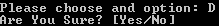 				                       |
| 005 | 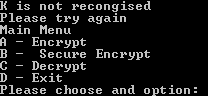 				                       |
| 006 | 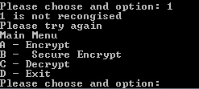 				                       |
| 007 | 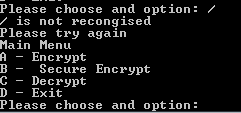 		                       |
| 008 | 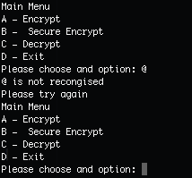 		                       		 |
| 009 | 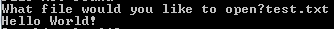 						 		 |
| 010 | 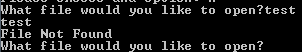 									 		 |
| 011 | 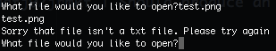 									 		 |
| 012 | 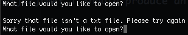 			 							 		 |
| 013 | 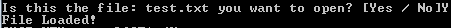 		 							 		 |
| 014 | 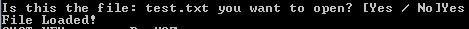 							 		 |
| 015 | 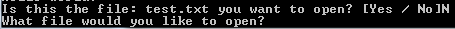     							 		 |
| 016 | 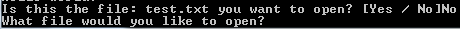   							 		 |
| 017 | 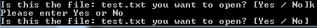 		 							 		 |
| 018 | 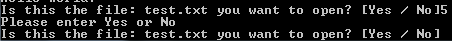 		 							 		 |
| 019 | 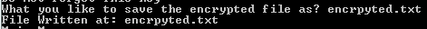|
| 020 | 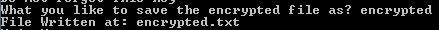 |
| 021 | 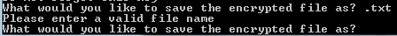 			 |
| 022 | 						 |
| 023 |  				 |
| 024 | 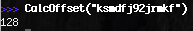            |


##Fully Working Program

###Encrypt
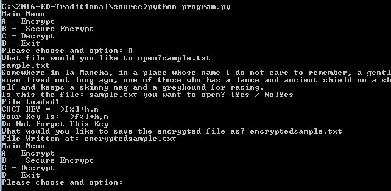

####Sample.txt
The contents of the unencrypted sample file:

	Somewhere in la Mancha, in a place whose name I do not care to remember, a
	gentleman lived not long ago, one of those who has a lance and ancient shield
	on a shelf and keeps a skinny nag and a greyhound for racing.

####Encrpytedsample.txt
The contents of the encrypted sample file:

	};91C41>1 5: 8- w-:/4-V 5: - <8-/1 C4;?1 :-91 s 0; :;@ /->1 @; >1919.1>V -
	31:@819-: 85B10 :;@ 8;:3 -3;V ;:1 ;2 @4;?1 C4; 4-? - 8-:/1 -:0 -:/51:@ ?45180
	;: - ?4182 -:0 711<? - ?75::E :-3 -:0 - 3>1E4;A:0 2;> >-/5:3X

####Decrypt of encryptedsample.txt

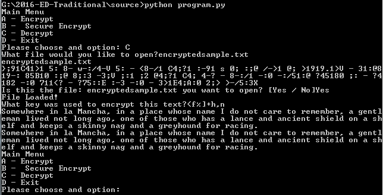

###Extended Encrypt
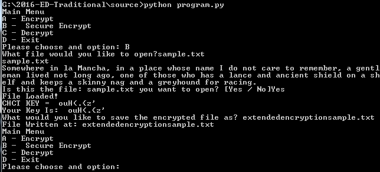

####Sample.txt
The contents of the unencrypted sample file:

	Somewhere in la Mancha, in a place whose name I do not care to remember, a
	gentleman lived not long ago, one of those who has a lance and ancient shield
	on a shelf and keeps a skinny nag and a greyhound for racing.

####extendedencrpytedsample.txt
The contents of the encrypted sample file:

	!=;3EL63@37L<:/y/L<16/XL7</>:L/13E6L=A3</L;3u2=L<=B1/L@3B=@L3;3;0L3@X/5L3<
	:3L;/<:7LD32<=LB:=<5L/5=X=L<3=4BL6=A3EL6=6/AL/:/<1L3/<2/L<173<LBA673L:2=<
	/LA63:4L/<293L3>A/AL97<<GL</5/<L2/5@3LG6=C<L24=@@L/17<5LZ#

####Decrypt of encryptedsample.txt

.PNG)


###Evaluation

####Task 1 - Main Menu
The main menu function meets the user's needs because it allows the user to select the operation they want to do: Encrypt, Extended Encrypted, Decrypt and Exit. This requires only one input from the user to select the operation they want to use. I could improve the interface by making it more graphical and also adding more instructions would make the program easier to use, for example when the user loads the main menu they don't know the difference between encrypt and extended encrypt so adding instructions or explanations could eliminate that problem.

####Task 2 - Read File
This function allows the user to enter the file containing the text they want to encrypt or decrypt. The function only requires one input the filename to begin with, it helps the user by printing the file name and the text inside the file - allowing the user to confirm that the file they opened is the right file. They can do this by entering yes or no when asked to confirm the file to open. This then takes the text and allows it to be used in the program. This allows the user to enter the text they want to encrypt from a file.

####Task 3 - Generating Key
The next function that is called is the generate key function. This function generates the key used by the program to calculate the offset factor used to encrypt the text. The function starts by generating the key and then prints it with a warning statement, warning them not to loose the key because they will need it to decrypt the text they are encrypting. This meets the user's needs by generating the key they need to encrypt the text without needing any input from the user.

####Task 4 - Producing Offset Value
The next function that gets run is the calcoffset function. This function occurs without the users knowledge. This function takes they key either produced by the genkey function or entered by the user and calculates a positive offset factor. This meets the users need because it produced the offset factor of which the text is offset by.

####Task 5 - Encrypt Text Function
This function again is run without the knowledge of the user in the background. This function adds the offset onto each character and converts it back to letters. This meets the user's need because they don't need to have any input but it encrypts the text 0 the main part of the program.

####Task 6 - Save File
This function is the final part of the encryption process, it allows the user to save the encrypted text into a new file. This helps the user because it save the file for they so they don't need to copy it out into a file. The user is asked to enter on value - the name of the file they want to save the encrypted text to. This meets the user's need because they need a way to save the data out of the program inside the program. I could improve this function by giving the user the option of save the file automatically instead of the user typing in a file name, the program could save the encrypted text to a file with the same original file name with a -encrypted on the end.

####Task 7 - Read File
This function allows the user to enter the file containing the text they want to encrypt or decrypt. The function only requires one input the filename to begin with, it helps the user by printing the file name and the text inside the file - allowing the user to confirm that the file they opened is the right file. They can do this by entering yes or no when asked to confirm the file to open. This then takes the text and allows it to be used in the program. This allows the user to enter the text they want to encrypt from a file.

####Task 8 - Decrypt Function
This function again is run without the knowledge of the user in the background. This function minuses the offset onto each character and converts it back to letters. This meets the user's need because they don't need to have any input but it decrypts the text - the main part of the program.

####Task 9 - Print Decrypted Message
This meets the users needs because it outputs the decrypted text for the user to view. It requires no other input from the user. I could improve this function by allowing the user to save the decrypted text to a file instead of just seeing it on the screen.

####Task 10 - Extended Encryption
This is the last part to meet the user's need because they needed a more secure way of encrypting the text, this groups the characters in block of 5 to add an extra layer of security to the encrypted text.
